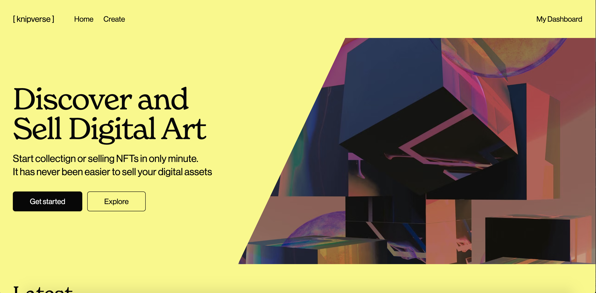
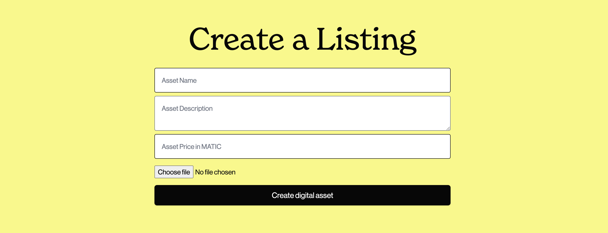
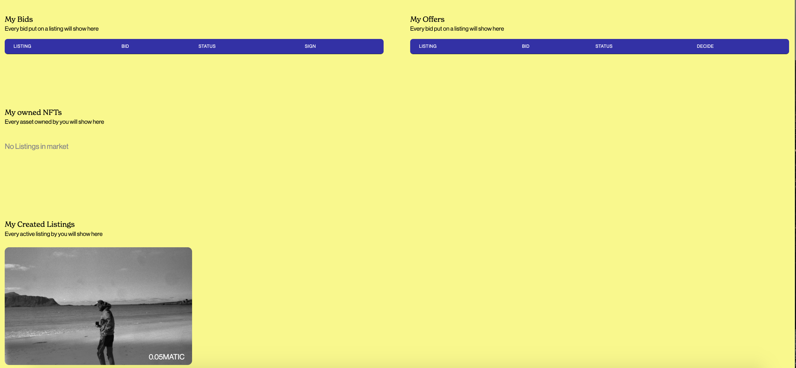

# NFT Marketplace

This project is a part of the project in 90748 - BLOCKCHAIN AND CRYPTOCURRENCIES at the University of Bologna. 
The project demonstrates a NFT market place for selling and buying NFTs using hardhat, next.js, solidity smart contracts and deployment to the polygon Mumbai testnet.

## Description
This project was created from the project proposal "Ethereum Layer 2 solutions:
Developing a Dapp on one of Etheruem's layer 2 solutions". The DApp consists of smart contracts for NFTs and for a NFTMarketplace written in solidity running on the Polygon PoS sidechain. The application allows one to connect via Metamask wallet and create, sell, bid on and buy NFTs on the marketplace. It has a dashboard where users can see all their bids and offers, owned NFTs and created listings and accept or reject offers on created listings.

The project is run with Hardhat, an Ethereum development environment, that allows for running solidity contracts locally and deploy to the blockchain networks. The application can either be run on a local node that can be setup woth hardhat, or as it is now on one of Ethereums layer 2 solutions, Polygon PoS. The Polygon PoS chain and node is used for much faster transaction speed, and smaller gas fees and full EVM compatibility. PolygonPOS uses the robust Plasma bridging framework to ensure securty and a decentralized network of Proof-of-Stake (PoS) validators. This can be considered less secure (but certainly not insecure!) than the ethereum main blockchain, but for small applications like this with many small transactionsthat you wouldnt' want high gas fees and slow transactions for, it is perfect. 

Most of the challenges met in this project has been regarding the Solidity smart contracts. Solidity is a high level, object oriented language for creating smart contracts and looks deceptively simple, but can be quite tricky to work with. The datastructures are not like javascript or any other high level language and because keys are handled wth hashes, iterations of these ar ealso very challenging to work with. Code written in solidity is often expensive to run and is also not easy to debug without using a framework like hardhat to write tests. Thus the greatest challenge of this project has been to get the correct datastructures of the marketplace and with it the code for interacting with it. It has also been very demanding to handle all logical edge cases regarding the application in terms of handlin offers and bids in solidty, but however it has been an experience where I have learned alot in a short period of time. 

## Technologies and libraries
* Solidity 
* Hardhat
* Polygon PoS Scalng solution
* Next.js (React)
* Web3Modal
* @openzeppelin/contracts
* Tailwind CSS for styling
* Ipfs-http-client for file uploading
* Ethers
* Axios
* Chai/Mocha/Hardhat for testing
* Metamask (Wallet)
* Moralis speedy node (polygon node)

## Features
* Connection via Metamask wallet
* Creating a NFT via form and uploading through IPFS
* See everyone elses listings
* See your owned NFTs
* See your active, created listings
* Buying or placing bids on listings
* Cancelling listings
* Selling owned NFTs with possibility to change metadata(price, description etc.)
* See status of bids placed by you
* See offers placed on your active listings with possibility to accept or reject offer
* Signing accepted offers in order to buy them

## Status and further development
The code is finalized for the intended project and purpose but still has some bug fixes in the front end part(loading of data is not great with respect to the feedback of the system) and some logical "errors" that are things that wouldn't be possible to do in a real world application, which I would like to fix in the future. I would also like to implement the possibility for everyone to see all offers on a listing and not just the seller and to add timed autions, highest bidder and purchase history functionalities. 

## Screenshots





## Installing and running project
Start by cloning the project and installing all dependencies via npm or yard
```shell
git clone https://github.com/williamostensen98/nft-marketplace.git

cd nft-marketplace

# install using NPM or Yarn
npm install

# or

yarn
```
It is then possible to either setup the application locally or with the Mumbai testnet(polygon)
### Local setup
1. Setup the localhost custom network in metamask to be able to connect. To do this press "Add network" -> Add the localhost with the correct port running i.e. "http://localhost:port" -> add chain id equal to the one set in config file
2. Run the local Hardhat node
```
npx hardhat node
```
3. With the network running, deploy the contracts to the local network via the deploy script in a separate window
```
npx hardhat run scripts/deploy.js --network localhost
```
4. Add the deployed contract addresses to the config file
5. Run the app
```
npm run dev
```
### Running on Mumbai Testnet
To deploy and run on polygon you need to either use a RPC from [polygon docs](https://docs.polygon.technology/docs/develop/network-details/network) or get a speedy node from Moralis or a similar provider. This url can be stored inside an environment variable to get acces to it in the hardhat config file and in the file that uses the JSONRPC (here the hook useLoadAllNfts). You also need to store your private key of the account that the contracts will be deployed from into a .secret file or similar. 

After this you can add a new network with chain id found on the polygon docs and rpc either to the public ones or from the speedy nodes from Moralis.
When all this is setup you can run the same deployment command but now with mumbai: 
```
npx hardhat run scripts/deploy.js --network mumbai
```
Add the deployed contract addresses to the config file and run the app
```
npm run dev
```

## Tests
A lot of tests for specific use cases are written using hardhat/Mocha and Chai. These run like usual with a describe that descrbes the main topic of test and sub cases via the it function. All the test can be found in the test folder and can easily be run via the command
```
npx hardhat test
```
All the test are run with the Hardhat Network, which acts as a local Ethereum network designed for development that is built-in and the default network in Hardhat. You don't need to setup anything to use it. The tests uses ethers.js to interact with the Ethereum smart contracts and Mocha as the test runner.

## Developed by
* William Østensen
* 
## License
[](https://opensource.org/licenses/MIT)
